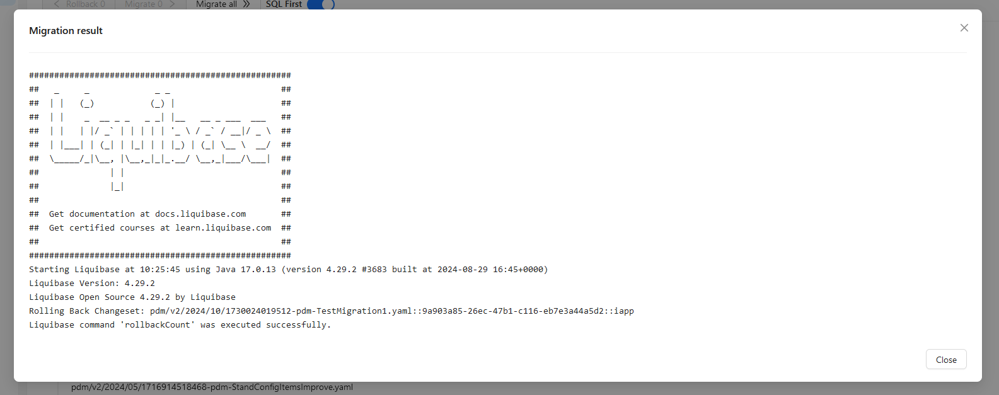

# Liquibase Admin

Liquibase Admin is designed to assist developers in managing database migrations with an easy-to-use interface.

The project already includes a Liquibase image and a management system for running it.

From the admin panel, you can perform database migrations, roll back migrations, and view which migrations have already
been executed and how they were executed.

Currently, Liquibase Admin only supports PostgreSQL.

## Features

Liquibase Admin provides a convenient interface for managing migrations.


Here, you can view all executed migrations as well as those that are pending.

You can select specific migrations from the list to roll back or apply (currently, only sequential rollback or execution
is supported).

If the `SQL First` switch is active, the migration or rollback command will not be executed immediately.
Instead, a modal window will appear, allowing you to preview the SQL changes that will be sent to the database upon
command execution.

The modal window displays the full process standard output from Liquibase, formatting SQL when available.


If `SQL First` is active, you can click the "Run" button in the Migration Preview,
and all displayed changes will be applied to the database.

Upon completion of the operation, a modal window will show its output.


## Deployment

An example `docker-compose` file can be found [in the repository](./compose/docker-compose.yml).

Copy it to a separate folder on your computer along with the [.env](./compose/.env) file,
edit the .env file as needed, then open the folder in your terminal and run

```shell
docker-compose up -d
```

### Environment Variables

#### Database Settings

The database is used to track already executed migrations. Additionally, the Liquibase process starts with connection
parameters for the specified database.

- `DB_HOST` - Database host
- `DB_PORT` - Database port
- `DB_NAME` - Database name
- `DB_USER` - Database user
- `DB_PASS` - Database password

#### Liquibase Process Settings

- `LIQ_CHANGELOG_DIR` - Liquibase working directory. It also serves as the root for all changelog files by default
- `LIQ_CHANGELOG_ENTRY_FILE` - Main changelog file for migrations, including all others
